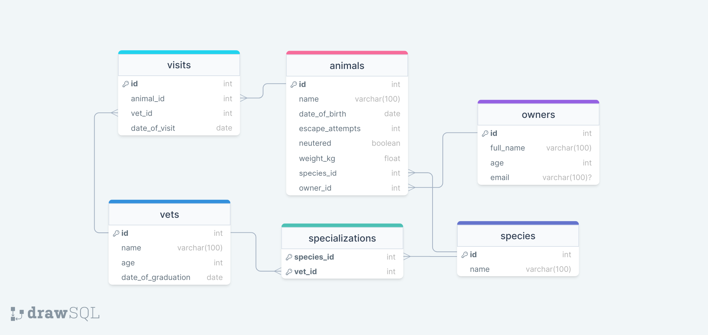

# Vet Clinic Database



## Getting Started

This repository includes files with plain SQL that can be used to recreate a database:

- Use [schema.sql](./schema.sql) to create all tables.
- Use [data.sql](./data.sql) to populate tables with sample data.
- Check [queries.sql](./queries.sql) for examples of queries that can be run on a newly created database. **Important note: this file might include queries that make changes in the database (e.g., remove records). Use them responsibly!**

<a name="readme-top"></a>

<!-- TABLE OF CONTENTS -->

# 📗 Table of Contents

- [📖 About the Project](#about-project)
  - [🛠 Built With](#built-with)
    - [Tech Stack](#tech-stack)
    - [Key Features](#key-features)
- [💻 Getting Started](#getting-started)
  - [Setup](#setup)
  - [Prerequisites](#prerequisites)
- [👥 Authors](#authors)
- [🔭 Future Features](#future-features)
- [🤝 Contributing](#contributing)
- [⭐️ Show your support](#support)
- [📝 License](#license)

<!-- PROJECT DESCRIPTION -->

# 📖 Vet Clinic Database <a name="about-project"></a>

Real-life example of a database for a vet clinic.

## 🛠 Built With <a name="built-with"></a>

### Tech Stack <a name="tech-stack"></a>

- [PostgreSQL](https://www.postgresql.org/)

### Key Features <a name="key-features"></a>

- **[Data management using Postgre SQL tables]**
- **[Table relationships one to many and many to many]**

<p align="right">(<a href="#readme-top">back to top</a>)</p>

<!-- GETTING STARTED -->

## 💻 Getting Started <a name="getting-started"></a>

To get a local copy up and running, follow these steps.

### Prerequisites

In order to run this project you need PostgreSQL installed on your machine. You can download it from [here](https://www.postgresql.org/download/).

### Setup

Clone this repository to your desired folder:

```sh
  git clone git@github.com:rashedarman/vet-clinic-database.git
```

<p align="right">(<a href="#readme-top">back to top</a>)</p>

<!-- AUTHORS -->

## 👥 Authors <a name="authors"></a>

👤 **Author1**

- GitHub: [@rashedarman](https://github.com/rashedarman)
- Twitter: [@rashedarman21](https://twitter.com/rashedarman21)
- LinkedIn: [@rashedarman](https://linkedin.com/in/rashedarman)

👤 **Author2**

- GitHub: [@simplegoose](https://github.com/simplegoose)
- LinkedIn: [@Timothy Njoroge](https://linkedin.com/in/timothy-njoroge-mwangi)

<p align="right">(<a href="#readme-top">back to top</a>)</p>

<!-- FUTURE FEATURES -->

## 🔭 Future Features <a name="future-features"></a>

- [Client] **[Creating an interactive client for the database]**

<p align="right">(<a href="#readme-top">back to top</a>)</p>

<!-- CONTRIBUTING -->

## 🤝 Contributing <a name="contributing"></a>

Contributions, issues, and feature requests are welcome!

Feel free to check the [issues page](../../issues/).

<p align="right">(<a href="#readme-top">back to top</a>)</p>

<!-- SUPPORT -->

## ⭐️ Show your support <a name="support"></a>

If you like this project please give it a ⭐️!

<p align="right">(<a href="#readme-top">back to top</a>)</p>

<!-- LICENSE -->

## 📝 License <a name="license"></a>

This project is [MIT](./LICENSE) licensed.

<p align="right">(<a href="#readme-top">back to top</a>)</p>
